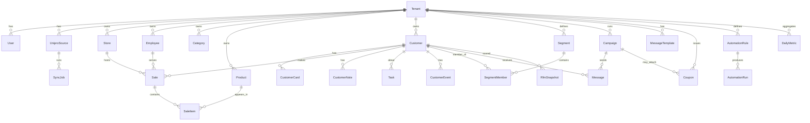
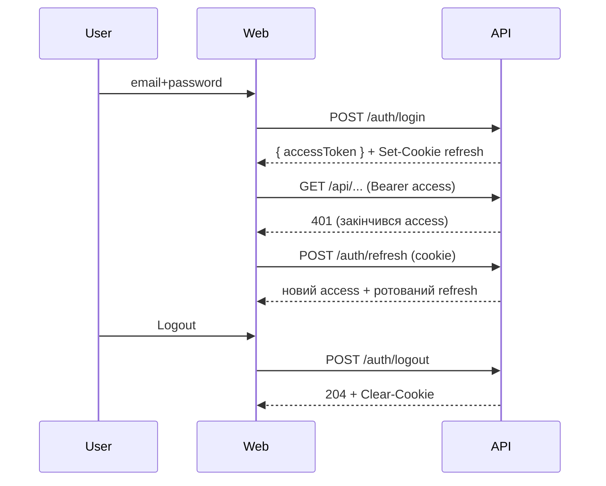

# Unipro CRM — Архітектурна специфікація

> Версія: 0.1 (draft, очікує погодження)
> Мова інтерфейсу: українська
> Призначення: SaaS-розширення для існуючих інсталяцій Unipro ERP (оптові/роздрібні магазини будматеріалів)

---

## 0. Принципи

1. **Read-only щодо Unipro.** Наша платформа НІКОЛИ не пише в БД Unipro (MS SQL). Тільки читає або приймає JSON.
2. **Feature-first** структура коду + Clean Architecture (domain / application / infrastructure / presentation).
3. **Multi-tenant SaaS.** Один інстанс — багато магазинів (tenants). Логічна ізоляція через `tenantId` у кожній таблиці + RLS-подібна перевірка в middleware.
4. **Прогресивна синхронізація.** Інкрементальна, ідемпотентна, з журналом конфліктів.
5. **Strict TypeScript** (`strict: true`, `noUncheckedIndexedAccess: true`).
6. **SOLID + Repository pattern** для всіх доступів до БД у backend.
7. **i18n-ready**, але дефолт і MVP — українська.

---

## 1. Структура папок (монорепозиторій)

```
unipro-crm/
├── apps/
│   ├── api/                          # NestJS backend
│   │   ├── src/
│   │   │   ├── main.ts
│   │   │   ├── app.module.ts
│   │   │   ├── config/               # env, validation, logger
│   │   │   ├── common/               # guards, interceptors, decorators, pipes, filters
│   │   │   │   ├── decorators/
│   │   │   │   ├── guards/
│   │   │   │   ├── interceptors/
│   │   │   │   ├── pipes/
│   │   │   │   ├── filters/
│   │   │   │   └── tenant/           # TenantContext, TenantGuard
│   │   │   ├── modules/              # FEATURE-FIRST
│   │   │   │   ├── auth/
│   │   │   │   │   ├── domain/
│   │   │   │   │   ├── application/  # use-cases
│   │   │   │   │   ├── infrastructure/
│   │   │   │   │   └── presentation/ # controllers, dto
│   │   │   │   ├── tenants/
│   │   │   │   ├── users/
│   │   │   │   ├── customers/
│   │   │   │   ├── sales/
│   │   │   │   ├── products/
│   │   │   │   ├── categories/
│   │   │   │   ├── stores/
│   │   │   │   ├── employees/
│   │   │   │   ├── cards/
│   │   │   │   ├── segments/         # RFM, ABC, XYZ, custom filters
│   │   │   │   ├── analytics/
│   │   │   │   ├── dashboard/
│   │   │   │   ├── campaigns/
│   │   │   │   ├── messaging/        # SMS / Email / Viber / Telegram адаптери
│   │   │   │   ├── coupons/
│   │   │   │   ├── automation/       # rule engine
│   │   │   │   ├── tasks/
│   │   │   │   ├── notes/
│   │   │   │   ├── sync/             # синхронізація з Unipro
│   │   │   │   │   ├── adapters/
│   │   │   │   │   │   ├── mssql/    # read-only MSSQL адаптер
│   │   │   │   │   │   └── json/     # JSON-import адаптер
│   │   │   │   │   ├── importers/    # customers, sales, products...
│   │   │   │   │   ├── mappers/
│   │   │   │   │   ├── jobs/         # BullMQ воркери
│   │   │   │   │   └── audit/
│   │   │   │   └── ai/               # майбутній AI-асистент
│   │   │   ├── shared/               # base entities, value objects
│   │   │   └── prisma/               # PrismaService
│   │   ├── prisma/
│   │   │   ├── schema.prisma
│   │   │   └── migrations/
│   │   ├── test/
│   │   ├── Dockerfile
│   │   └── package.json
│   │
│   └── web/                          # React + Vite frontend
│       ├── src/
│       │   ├── main.tsx
│       │   ├── App.tsx
│       │   ├── router/
│       │   ├── app/                  # store, providers, query-client
│       │   ├── shared/
│       │   │   ├── ui/               # DaisyUI-based primitives
│       │   │   ├── lib/              # http, formatters, hooks
│       │   │   ├── i18n/             # uk.json
│       │   │   └── types/
│       │   ├── features/             # FEATURE-FIRST
│       │   │   ├── auth/
│       │   │   ├── dashboard/
│       │   │   ├── customers/
│       │   │   ├── segments/
│       │   │   ├── campaigns/
│       │   │   ├── automation/
│       │   │   ├── analytics/
│       │   │   ├── coupons/
│       │   │   ├── sync/
│       │   │   ├── settings/
│       │   │   └── ai/
│       │   ├── pages/                # тонкі route-компоненти
│       │   └── widgets/              # композитні блоки (sidebar, header, charts)
│       ├── public/
│       ├── index.html
│       ├── tailwind.config.ts
│       ├── vite.config.ts
│       └── Dockerfile
│
├── packages/                         # shared між apps
│   ├── shared-types/                 # DTO, enum, contract-types
│   ├── eslint-config/
│   └── tsconfig/
│
├── infra/
│   ├── docker-compose.yml            # postgres, redis, api, web, mailhog
│   ├── docker-compose.prod.yml
│   ├── nginx/
│   └── github-actions/
│
├── docs/
│   ├── ARCHITECTURE.md
│   ├── SYNC.md
│   ├── API.md
│   └── ROADMAP.md
│
├── .editorconfig
├── package.json                      # pnpm workspaces
├── pnpm-workspace.yaml
└── README.md
```

**Кожен модуль (NestJS)** дотримується розкладу:

```
modules/<feature>/
  domain/        # Entities, Value Objects, доменні події
  application/   # Use-cases (CommandHandler / QueryHandler), порти (інтерфейси репозиторіїв)
  infrastructure/# Prisma-репозиторії, адаптери до зовнішніх систем
  presentation/  # Controllers, DTO, Validators
  <feature>.module.ts
```

---

## 2. Схема БД (PostgreSQL, Prisma)

> Всі таблиці мають `tenantId`, `createdAt`, `updatedAt`. М'яке видалення через `deletedAt` де доцільно.

```prisma
// === Tenancy & Auth =========================================================

model Tenant {
  id            String   @id @default(cuid())
  name          String
  slug          String   @unique
  plan          Plan     @default(TRIAL)
  status        TenantStatus @default(ACTIVE)
  settings      Json     @default("{}")
  createdAt     DateTime @default(now())
  updatedAt     DateTime @updatedAt

  users         User[]
  uniproSources UniproSource[]
  customers     Customer[]
  // ... всі тенантні сутності
}

model User {
  id           String   @id @default(cuid())
  tenantId     String
  email        String
  passwordHash String
  fullName     String
  role         UserRole @default(MANAGER)
  status       UserStatus @default(ACTIVE)
  lastLoginAt  DateTime?
  createdAt    DateTime @default(now())
  updatedAt    DateTime @updatedAt

  tenant       Tenant   @relation(fields: [tenantId], references: [id])
  refreshTokens RefreshToken[]

  @@unique([tenantId, email])
}

model RefreshToken {
  id         String   @id @default(cuid())
  userId     String
  tokenHash  String   @unique
  userAgent  String?
  ip         String?
  expiresAt  DateTime
  revokedAt  DateTime?
  createdAt  DateTime @default(now())
  user       User     @relation(fields: [userId], references: [id])
}

enum UserRole   { OWNER ADMIN MANAGER MARKETER VIEWER }
enum UserStatus { ACTIVE INVITED DISABLED }
enum Plan       { TRIAL STARTER PRO ENTERPRISE }
enum TenantStatus { ACTIVE SUSPENDED }

// === Unipro Sync ============================================================

model UniproSource {
  id           String   @id @default(cuid())
  tenantId     String
  name         String              // напр. "Магазин №1"
  type         UniproSourceType    // MSSQL | JSON_PUSH
  connection   Json                // зашифровано (host, db, user, etc.) або endpoint+token
  enabled      Boolean  @default(true)
  lastSyncAt   DateTime?
  lastSyncStatus SyncStatus?
  createdAt    DateTime @default(now())
  updatedAt    DateTime @updatedAt

  tenant       Tenant   @relation(fields: [tenantId], references: [id])
  jobs         SyncJob[]
}

model SyncJob {
  id          String   @id @default(cuid())
  sourceId    String
  entity      SyncEntity
  startedAt   DateTime @default(now())
  finishedAt  DateTime?
  status      SyncStatus
  itemsRead   Int      @default(0)
  itemsUpserted Int    @default(0)
  errorsCount Int      @default(0)
  cursor      String?            // last processed key / timestamp
  errorLog    Json?
  source      UniproSource @relation(fields: [sourceId], references: [id])
}

enum UniproSourceType { MSSQL JSON_PUSH }
enum SyncStatus       { PENDING RUNNING SUCCESS FAILED PARTIAL }
enum SyncEntity       { CUSTOMERS SALES SALE_ITEMS PRODUCTS CATEGORIES STORES EMPLOYEES CUSTOMER_CARDS }

// === Master Data (зеркало Unipro) ==========================================

model Store {
  id         String  @id @default(cuid())
  tenantId   String
  externalId String                  // ID у Unipro
  code       String?
  name       String
  city       String?
  address    String?
  createdAt  DateTime @default(now())
  updatedAt  DateTime @updatedAt
  @@unique([tenantId, externalId])
}

model Employee {
  id         String  @id @default(cuid())
  tenantId   String
  externalId String
  fullName   String
  storeId    String?
  position   String?
  @@unique([tenantId, externalId])
}

model Category {
  id         String  @id @default(cuid())
  tenantId   String
  externalId String
  name       String
  parentId   String?
  path       String?               // matpath для швидких запитів
  @@unique([tenantId, externalId])
}

model Product {
  id         String  @id @default(cuid())
  tenantId   String
  externalId String
  sku        String?
  name       String
  brand      String?
  categoryId String?
  unit       String?
  attributes Json?
  @@unique([tenantId, externalId])
  @@index([tenantId, brand])
}

model Customer {
  id            String   @id @default(cuid())
  tenantId      String
  externalId    String
  fullName      String
  phone         String?
  email         String?
  birthDate     DateTime?
  gender        Gender?
  city          String?
  source        String?              // звідки прийшов
  consentSms    Boolean  @default(false)
  consentEmail  Boolean  @default(false)
  consentViber  Boolean  @default(false)
  consentTelegram Boolean @default(false)
  firstPurchaseAt DateTime?
  lastPurchaseAt  DateTime?
  totalRevenue    Decimal  @default(0)
  totalOrders     Int      @default(0)
  avgOrderValue   Decimal  @default(0)
  rfmScore        String?            // напр. "545"
  segmentId       String?
  segmentLabel    SegmentLabel?
  ltv             Decimal  @default(0)
  createdAt    DateTime @default(now())
  updatedAt    DateTime @updatedAt
  deletedAt    DateTime?

  notes        CustomerNote[]
  tasks        Task[]
  sales        Sale[]
  cards        CustomerCard[]
  events       CustomerEvent[]

  @@unique([tenantId, externalId])
  @@index([tenantId, phone])
  @@index([tenantId, email])
  @@index([tenantId, segmentLabel])
}

enum Gender { MALE FEMALE OTHER }
enum SegmentLabel {
  CHAMPIONS LOYAL POTENTIAL_LOYAL NEW PROMISING NEED_ATTENTION
  ABOUT_TO_SLEEP AT_RISK CANT_LOSE HIBERNATING LOST
}

model CustomerCard {
  id         String  @id @default(cuid())
  tenantId   String
  externalId String
  customerId String
  number     String
  type       String?
  issuedAt   DateTime?
  customer   Customer @relation(fields: [customerId], references: [id])
  @@unique([tenantId, externalId])
  @@index([tenantId, number])
}

model Sale {
  id          String   @id @default(cuid())
  tenantId    String
  externalId  String
  storeId     String?
  customerId  String?
  employeeId  String?
  number      String?
  date        DateTime
  total       Decimal
  discount    Decimal  @default(0)
  paymentType String?
  channel     String?              // RETAIL / WHOLESALE
  createdAt   DateTime @default(now())

  items       SaleItem[]
  customer    Customer? @relation(fields: [customerId], references: [id])

  @@unique([tenantId, externalId])
  @@index([tenantId, date])
  @@index([tenantId, customerId])
}

model SaleItem {
  id        String   @id @default(cuid())
  tenantId  String
  saleId    String
  productId String?
  qty       Decimal
  price     Decimal
  discount  Decimal  @default(0)
  total     Decimal
  sale      Sale     @relation(fields: [saleId], references: [id], onDelete: Cascade)
  @@index([tenantId, productId])
}

// === CRM ====================================================================

model CustomerNote {
  id         String   @id @default(cuid())
  tenantId   String
  customerId String
  authorId   String
  body       String
  pinned     Boolean  @default(false)
  createdAt  DateTime @default(now())
  customer   Customer @relation(fields: [customerId], references: [id])
}

model Task {
  id          String   @id @default(cuid())
  tenantId    String
  customerId  String?
  assigneeId  String?
  title       String
  description String?
  status      TaskStatus @default(OPEN)
  priority    TaskPriority @default(MEDIUM)
  dueAt       DateTime?
  completedAt DateTime?
  createdAt   DateTime @default(now())
  customer    Customer? @relation(fields: [customerId], references: [id])
}
enum TaskStatus   { OPEN IN_PROGRESS DONE CANCELED }
enum TaskPriority { LOW MEDIUM HIGH URGENT }

model CustomerEvent {
  id         String   @id @default(cuid())
  tenantId   String
  customerId String
  type       CustomerEventType
  payload    Json
  occurredAt DateTime @default(now())
  customer   Customer @relation(fields: [customerId], references: [id])
  @@index([tenantId, customerId, occurredAt])
}
enum CustomerEventType {
  PURCHASE SEGMENT_CHANGED MESSAGE_SENT MESSAGE_OPENED COUPON_ISSUED COUPON_REDEEMED
  NOTE_ADDED TASK_CREATED LOGIN BIRTHDAY
}

// === Segmentation ===========================================================

model Segment {
  id          String   @id @default(cuid())
  tenantId    String
  name        String
  description String?
  type        SegmentType
  filter      Json                  // JSON-DSL фільтру
  isDynamic   Boolean  @default(true)
  membersCount Int     @default(0)
  lastBuiltAt  DateTime?
  createdAt    DateTime @default(now())
  members      SegmentMember[]
}
enum SegmentType { RFM ABC XYZ MANUAL DYNAMIC }

model SegmentMember {
  segmentId  String
  customerId String
  addedAt    DateTime @default(now())
  @@id([segmentId, customerId])
}

// === Campaigns & Messaging ==================================================

model Campaign {
  id           String   @id @default(cuid())
  tenantId     String
  name         String
  channel      Channel
  status       CampaignStatus @default(DRAFT)
  audienceId   String?            // Segment
  templateId   String?
  scheduleAt   DateTime?
  startedAt    DateTime?
  finishedAt   DateTime?
  stats        Json   @default("{}")
  createdById  String
  createdAt    DateTime @default(now())

  messages     Message[]
}
enum Channel        { SMS EMAIL VIBER TELEGRAM PUSH }
enum CampaignStatus { DRAFT SCHEDULED RUNNING PAUSED COMPLETED FAILED }

model MessageTemplate {
  id         String   @id @default(cuid())
  tenantId   String
  name       String
  channel    Channel
  subject    String?
  body       String
  variables  Json   @default("[]")
}

model Message {
  id          String   @id @default(cuid())
  tenantId    String
  campaignId  String?
  customerId  String
  channel     Channel
  to          String                // phone/email/chatId
  body        String
  status      MessageStatus @default(QUEUED)
  providerId  String?
  error       String?
  sentAt      DateTime?
  deliveredAt DateTime?
  openedAt    DateTime?
  clickedAt   DateTime?
  @@index([tenantId, customerId])
}
enum MessageStatus { QUEUED SENDING SENT DELIVERED FAILED OPENED CLICKED }

model Coupon {
  id          String   @id @default(cuid())
  tenantId    String
  code        String
  type        CouponType
  value       Decimal
  validFrom   DateTime
  validTo     DateTime
  perCustomer Int      @default(1)
  totalLimit  Int?
  usedCount   Int      @default(0)
  campaignId  String?
  customerId  String?               // персональний купон
  status      CouponStatus @default(ACTIVE)
  @@unique([tenantId, code])
}
enum CouponType    { PERCENT FIXED FREE_SHIPPING GIFT }
enum CouponStatus  { ACTIVE EXPIRED REVOKED }

// === Automation =============================================================

model AutomationRule {
  id          String   @id @default(cuid())
  tenantId    String
  name        String
  enabled     Boolean  @default(true)
  trigger     Json                  // { type: 'INACTIVITY_DAYS', params: { days: 60 } }
  conditions  Json                  // масив умов (AND/OR-дерево)
  actions     Json                  // масив дій
  cooldownH   Int      @default(24)
  lastRunAt   DateTime?
  createdAt   DateTime @default(now())

  runs        AutomationRun[]
}

model AutomationRun {
  id         String   @id @default(cuid())
  tenantId   String
  ruleId     String
  customerId String?
  status     AutomationRunStatus
  details    Json
  startedAt  DateTime @default(now())
  finishedAt DateTime?
  rule       AutomationRule @relation(fields: [ruleId], references: [id])
}
enum AutomationRunStatus { SUCCESS SKIPPED FAILED }

// === Analytics snapshots (матеріалізовані метрики) =========================

model DailyMetric {
  tenantId   String
  date       DateTime
  storeId    String?
  revenue    Decimal
  orders     Int
  customers  Int
  newCustomers Int
  avgOrder   Decimal
  @@id([tenantId, date, storeId])
}

model RfmSnapshot {
  id         String   @id @default(cuid())
  tenantId   String
  customerId String
  r          Int
  f          Int
  m          Int
  score      String
  label      SegmentLabel
  builtAt    DateTime @default(now())
  @@index([tenantId, builtAt])
}

// === Audit ==================================================================

model AuditLog {
  id        String   @id @default(cuid())
  tenantId  String
  userId    String?
  action    String
  entity    String
  entityId  String?
  meta      Json?
  ip        String?
  createdAt DateTime @default(now())
}
```

---

## 3. ER-діаграма



---

## 4. Модулі NestJS

| Модуль | Відповідальність |
|---|---|
| `AuthModule` | JWT access+refresh, login/logout/refresh, recovery, invites |
| `TenantsModule` | Створення/налаштування tenant'ів, плани, статуси |
| `UsersModule` | Користувачі магазину, ролі, запрошення |
| `SyncModule` | Підключення до Unipro (MSSQL/JSON), джоби імпорту, статуси |
| `CustomersModule` | CRUD дзеркала клієнтів, профіль, історія, події |
| `SalesModule` | Read-проєкції продажів, агрегації |
| `ProductsModule` | Дзеркало товарів і категорій |
| `StoresModule` / `EmployeesModule` | Довідники з Unipro |
| `CardsModule` | Карти лояльності (read-only з Unipro) |
| `SegmentsModule` | RFM, ABC, XYZ, custom-фільтри, побудова та матеріалізація |
| `AnalyticsModule` | Тренди, когорти, LTV, heatmaps |
| `DashboardModule` | Композитні KPI для головної |
| `CampaignsModule` | CRUD кампаній, планування, статистика |
| `MessagingModule` | Адаптери провайдерів (SMS, Email, Viber, Telegram), черги BullMQ |
| `TemplatesModule` | Шаблони повідомлень + змінні `{{customer.firstName}}` |
| `CouponsModule` | Генерація/видача/відстеження купонів |
| `AutomationModule` | Rule engine: triggers / conditions / actions |
| `TasksModule` / `NotesModule` | CRM-нотатки і задачі по клієнту |
| `AuditModule` | Системний журнал дій |
| `AiModule` (фаза 2) | Прокладка для LLM-запитів |
| `HealthModule` | Liveness/Readiness, метрики |

**Інфраструктура:** `PrismaModule`, `QueueModule` (BullMQ + Redis), `MailerModule`, `ConfigModule`, `LoggerModule` (pino), `I18nModule`.

---

## 5. Список API (REST, префікс `/api/v1`)

> Всі ендпоінти, крім `/auth/*` і `/health`, потребують JWT + `tenantId` із токена.
> Пагінація: `?page=&pageSize=&sort=&order=`. Фільтри — через query або POST `/search`.

### Auth
- `POST /auth/login` — email+password → access+refresh
- `POST /auth/refresh` — refresh → нова пара
- `POST /auth/logout` — відкликати refresh
- `POST /auth/forgot-password`
- `POST /auth/reset-password`
- `GET  /auth/me`
- `POST /auth/invites/accept`

### Tenants & Users
- `GET  /tenant` / `PATCH /tenant`
- `GET  /users` / `POST /users/invite` / `PATCH /users/:id` / `DELETE /users/:id`

### Sync (Unipro)
- `GET  /sync/sources`
- `POST /sync/sources` (MSSQL або JSON_PUSH)
- `PATCH /sync/sources/:id` / `DELETE /sync/sources/:id`
- `POST /sync/sources/:id/test`
- `POST /sync/sources/:id/run` (запустити повну/інкрементну)
- `GET  /sync/jobs?sourceId=&status=`
- `GET  /sync/jobs/:id`
- `POST /sync/ingest/json` — для пуш-режиму з агента Unipro

### Master data (read-only)
- `GET /stores` / `GET /stores/:id`
- `GET /employees`
- `GET /categories`
- `GET /products` (фільтри: brand, categoryId, q)
- `GET /products/:id`

### Customers
- `GET  /customers` (фільтри: q, segment, city, lastPurchaseFrom/To, totalRevenueMin…)
- `POST /customers/search` (складні фільтри/JSON-DSL)
- `GET  /customers/:id`
- `PATCH /customers/:id` (тільки CRM-поля: notes-консенти, теги)
- `GET  /customers/:id/sales`
- `GET  /customers/:id/events`
- `GET  /customers/:id/messages`
- `GET  /customers/:id/coupons`
- `GET  /customers/:id/tasks`

### Notes & Tasks
- `GET/POST /customers/:id/notes` / `PATCH/DELETE /notes/:id`
- `GET/POST /tasks` / `PATCH/DELETE /tasks/:id`

### Segments
- `GET /segments` / `POST /segments` / `PATCH /segments/:id` / `DELETE /segments/:id`
- `POST /segments/:id/rebuild`
- `GET  /segments/:id/members`
- `POST /segments/preview` (повертає count + sample за фільтром без збереження)
- `POST /segments/rfm/rebuild` (повний перерахунок RFM)

### Analytics & Dashboard
- `GET /dashboard/overview?from=&to=&storeId=`
- `GET /analytics/sales-trend?granularity=day|week|month`
- `GET /analytics/cohorts`
- `GET /analytics/abc?dimension=customers|products`
- `GET /analytics/rfm-distribution`
- `GET /analytics/ltv`
- `GET /analytics/product-affinity`
- `GET /analytics/heatmap?metric=revenue`
- `GET /analytics/dormant`
- `GET /analytics/lost`
- `GET /analytics/new-customers`
- `GET /analytics/top-customers`

### Campaigns & Messaging
- `GET/POST /campaigns` / `GET /campaigns/:id` / `PATCH /campaigns/:id`
- `POST /campaigns/:id/schedule`
- `POST /campaigns/:id/pause` / `/resume` / `/cancel`
- `GET  /campaigns/:id/stats`
- `GET/POST /templates` / `PATCH/DELETE /templates/:id`
- `POST /messages/test` (надіслати тест на 1 контакт)
- `GET  /messages?customerId=&campaignId=`
- Webhooks: `POST /webhooks/messaging/:provider`

### Coupons
- `GET/POST /coupons` / `PATCH /coupons/:id`
- `POST /coupons/issue` (видати клієнту/сегменту)
- `POST /coupons/redeem` (відмітити погашення, з Unipro-агента)

### Automation
- `GET/POST /automation/rules` / `PATCH /automation/rules/:id`
- `POST /automation/rules/:id/enable|disable`
- `POST /automation/rules/:id/test` (dry-run на сегменті)
- `GET  /automation/runs?ruleId=`

### AI (фаза 2)
- `POST /ai/ask` — `{ question }` → відповідь + посилання на сегменти/звіти

### System
- `GET /health/live`, `GET /health/ready`
- `GET /audit?entity=&userId=`

---

## 6. Архітектура синхронізації з Unipro

### Два режими

1. **Pull (read-only MSSQL)**
   - Користувач задає у налаштуваннях: host, port, db, login, password (шифруються `AES-256-GCM` ключем з env).
   - `MssqlAdapter` (через `mssql` npm) виконує **тільки SELECT**. Право користувача в MSSQL має бути обмежене на рівні БД (інструкція в `docs/SYNC.md`).
   - Інкрементальність: для кожної сутності — `cursor` (max(updatedAt) або id).

2. **Push (JSON sync)**
   - Окремий легкий **Unipro Agent** (Windows-сервіс, поставляється нами) періодично читає Unipro і шле JSON-batch'і на `POST /sync/ingest/json` з API-ключем джерела.
   - Підтримує офлайн-буфер, ретраї, дедуплікацію.

### Потік даних

```mermaid
flowchart LR
  subgraph Client_Site[На стороні клієнта]
    UDB[(Unipro MSSQL)]
    AGENT[Unipro Agent (опц.)]
  end
  subgraph Cloud[Unipro CRM Cloud]
    API[NestJS API]
    Q[(Redis / BullMQ)]
    W[Sync Workers]
    PG[(PostgreSQL)]
  end
  UDB -- READ ONLY --> API
  UDB --> AGENT -- HTTPS JSON --> API
  API --> Q --> W --> PG
  W -- події --> Q
```

### Pipeline імпорту (для кожної сутності)

```
1. Plan      : визначаємо cursor / window
2. Extract   : MSSQL SELECT або JSON batch
3. Map       : MSSQL row → канонічний DTO (модулі mappers/)
4. Validate  : zod-схема
5. Upsert    : Prisma upsert by (tenantId, externalId)
6. Project   : оновити Customer.totals, події, RFM-черги
7. Audit     : SyncJob.itemsRead/Upserted/errors, cursor
```

### Послідовність та залежності
`Stores → Employees → Categories → Products → CustomerCards → Customers → Sales → SaleItems`.
Кожна сутність — окрема Bull-черга з backoff і concurrency.

### Розклад
- Інкрементна синхронізація: cron `*/15 * * * *` (налаштовується).
- Повна реконсиляція: щоночі.
- Перерахунок RFM/ABC/DailyMetric: після успішного імпорту `Sales`.

### Безпека
- Креди MSSQL зберігаються зашифрованими (envelope encryption).
- IP allowlist для `/sync/ingest/json`.
- Окремий `SyncApiKey` per source.
- Read-only логін у MSSQL — обов'язкова умова в onboarding.

---

## 7. Auth flow

- **JWT access** (15 хв) + **refresh token** (30 днів, ротація).
- Refresh зберігається як `bcrypt(hash)` у `RefreshToken`. При використанні — стара токен-родина відкликається (reuse detection).
- Cookies `httpOnly; Secure; SameSite=Lax` для refresh; access — у пам'яті фронта (Authorization header).
- Ролі: `OWNER, ADMIN, MANAGER, MARKETER, VIEWER` (RBAC через `@Roles()` декоратор + `RolesGuard`).
- Tenant scoping: `TenantGuard` витягує `tenantId` з JWT і пробрасує в `AsyncLocalStorage`, всі Prisma-репозиторії додають `where: { tenantId }`.
- 2FA (TOTP) — фаза 2.
- Запрошення користувачів через одноразовий signed-токен.



---

## 8. UI-сторінки (всі підписи — українською)

Layout: бічна навігація (collapsible) + верхній бар (пошук, тенант-перемикач, профіль). Тема DaisyUI: `light` + `corporate`.

| Розділ | Сторінки |
|---|---|
| **Авторизація** | Вхід, Відновлення паролю, Скидання паролю, Прийняття запрошення |
| **Дашборд** | `/` Огляд: KPI-картки (Виторг, Середній чек, Повторні покупки, LTV, Активні клієнти), графіки трендів, топ-клієнти, нові/втрачені, RFM-зведення |
| **Клієнти** | Список з фільтрами та збереженими виглядами; Профіль клієнта (вкладки: Огляд, Покупки, Події, Кампанії, Купони, Нотатки, Задачі) |
| **Сегменти** | Список сегментів; Конструктор сегмента (візуальний фільтр + preview лічильника); RFM-карта 5×5; ABC/XYZ-звіти |
| **Маркетинг → Кампанії** | Список; Майстер створення (Канал → Аудиторія → Шаблон → Розклад → Запуск); Деталі кампанії зі статистикою |
| **Маркетинг → Шаблони** | CRUD шаблонів з прев'ю і змінними |
| **Маркетинг → Купони** | Список; Створення (масові/персональні); Звіт по використанню |
| **Автоматизація** | Список правил; Конструктор правила (Тригер → Умови → Дії); Журнал запусків |
| **Аналітика** | Продажі (тренди, по магазинах), Когорти, LTV, Affinity/Cross-sell, Heatmap (день×година), Сплячі/Втрачені/Нові |
| **Задачі** | Канбан + список (мої / усі) |
| **Синхронізація** | Джерела Unipro (MSSQL/Agent), статуси, ручний запуск, журнал джобів і помилок |
| **Налаштування** | Профіль користувача, Користувачі і ролі, Тенант (план, ребрендинг), Інтеграції (SMS/Email/Viber/Telegram провайдери), API-ключі, Журнал аудиту |
| **AI-асистент** (фаза 2) | Чат "Запитай у даних" + збережені інсайти |

UX-стандарти:
- Skeleton-loaders, empty states з CTA, toast-нотифікації.
- TanStack Query для всіх даних + оптимістичні апдейти.
- Адаптив від 360px; основна робота — на ≥1280px.

---

## 9. Дорожня карта розробки

### Етап 0 — Фундамент
- Монорепо (pnpm), ESLint/Prettier, CI (GitHub Actions: lint+test+build), Docker Compose (Postgres, Redis, Mailhog).
- Базовий NestJS-скелет, Prisma init, Vite+React+Tailwind+DaisyUI скелет.
- `AuthModule` (JWT+refresh), `TenantsModule`, `UsersModule`, `i18n` (uk).

### Етап 1 — Синхронізація (MVP)
- `SyncModule` з MSSQL-адаптером (read-only) для: Stores, Employees, Categories, Products, Customers, CustomerCards, Sales, SaleItems.
- BullMQ воркери, журнал `SyncJob`, інкрементальність.
- Шифрування кредів, тест-конекшн.
- UI: Налаштування джерел + статус панелі.

### Етап 2 — Профіль клієнта + базовий дашборд
- `CustomersModule` (список, профіль, історія).
- Агрегати: totalRevenue, avgOrderValue, lastPurchaseAt.
- `DashboardModule`: KPI + базові графіки.
- UI: Клієнти, Профіль клієнта, Дашборд.

### Етап 3 — Сегменти і RFM
- Конструктор фільтрів (JSON-DSL) + матеріалізація `SegmentMember`.
- RFM-розрахунок як cron-джоб + `RfmSnapshot`.
- ABC по клієнтах і товарах.
- UI: Сегменти, RFM-карта, ABC.

### Етап 4 — CRM (нотатки, задачі, події)
- `NotesModule`, `TasksModule`, `CustomerEvent` стрічка.
- Канбан задач.

### Етап 5 — Маркетинг
- `TemplatesModule`, `CampaignsModule`, `MessagingModule` з адаптерами:
  - SMS (TurboSMS / SMSClub),
  - Email (SMTP/SendGrid),
  - Viber (TurboSMS Viber),
  - Telegram (Bot API).
- Планувальник, статистика, webhooks статусів.
- `CouponsModule` + ендпоінти видачі/погашення (для Unipro Agent).
- UI: Кампанії (майстер), Шаблони, Купони.

### Етап 6 — Автоматизація
- Rule engine: тригери (Cron, InactivityDays, Birthday, PurchaseThreshold, SegmentEntered/Left, NewCustomer), умови, дії (SendMessage, IssueCoupon, CreateTask, NotifyManager, AddToSegment).
- UI-конструктор правил, dry-run, журнал.

### Етап 7 — Розширена аналітика
- Когорти, LTV, Affinity (apriori/lift), Heatmaps, Dormant/Lost.
- Експорт у CSV/XLSX.

### Етап 8 — Hardening для продакшна
- RBAC-фіналізація, аудит, rate-limit, brute-force захист, helmet, CSP.
- Спостережуваність: pino + OpenTelemetry, метрики Prometheus, Sentry.
- Резервне копіювання, RPO/RTO документація.
- Підготовка onboarding-гайду і Unipro-агента (інсталятор).

### Етап 9 — AI (бета)
- `AiModule`: LLM-провайдер (через адаптер), вектор-індекс по агрегатах і сегментах, безпечні prompt-шаблони, audit запитів.
- Відповіді з прив'язкою до існуючих сегментів/звітів.

### Етап 10 — Білінг і само-обслуговування
- Тарифи, ліміти (кількість контактів, повідомлень, джерел), інвойсинг, інтеграція з платіжним провайдером.

---

## Подальші кроки

Прошу підтвердити або скоригувати:

1. **Стек і структуру** (монорепо `pnpm`, feature-first + clean architecture усередині модулів).
2. **Multi-tenant модель** (один інстанс, `tenantId` всюди).
3. **Дві опції синхронізації** (MSSQL read-only + JSON-агент).
4. **Перелік модулів і сутностей** у Prisma-схемі (особливо: чи потрібні XYZ-аналіз і AI у MVP).
5. **Послідовність етапів** дорожньої карти.

Після підтвердження переходимо до реалізації Етапу 0.
